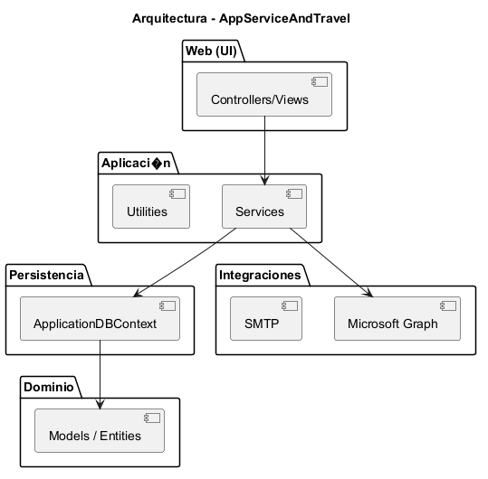
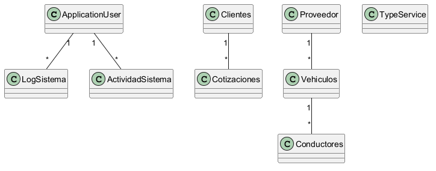
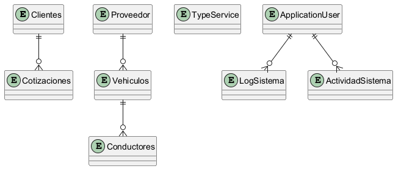


# AppServiceAndTravel

Descripción
-----------
Aplicación Razor Pages en .NET 8 para gestión de cotizaciones, clientes, operaciones (vehículos, conductores) y administración. Incluye generación de PDFs (QuestPDF) y se organiza por Areas: Comercial, Operaciones y Admin.

Requisitos
----------
- .NET 8 SDK
- SQL Server (o proveedor EF Core configurado)
- Java (para PlantUML)
- Graphviz (para PlantUML)
- PlantUML (plantuml.jar)
- Pandoc y un motor PDF (wkhtmltopdf o LaTeX) si quieres combinar Markdown -> PDF

Instalación y ejecución
-----------------------
1. Clonar el repositorio:
   git clone https://github.com/Fabiannavarrete24/AppServiceAndTravel.git

2. Configurar connection string en `appsettings.json` o Secret Manager:
   - `ConnectionStrings:DefaultConnection`

3. Aplicar migraciones:
   dotnet ef database update

4. Ejecutar la aplicación:
   dotnet run --project src/AppServiceAndTravel

Generación de documentación (diagramas y PDF)
---------------------------------------------
He incluido scripts y archivos PlantUML en `docs/`. Para generar los PDFs de diagramas y la documentación final sigue estos pasos:

- Instalar Java y Graphviz.
- Colocar `plantuml.jar` en `tools/plantuml/` o indicar su ruta.
- Ejecutar (desde la raíz del repo):
  PowerShell: `.\docs\generate_docs.ps1`

Lo anterior generará:
- PNG y PDF de cada `.puml` en `docs/output/`
- `docs/DOCUMENTACION_FINAL.pdf` que combina `README.md`, `INFORME_TECNICO.md` y los diagramas.

Notas importantes
-----------------
- Proyecto usa QuestPDF para generar cotizaciones (ver `Services/PdfService.cs`).
- Revisa `Program.cs` para los servicios registrados y políticas de autorización.
- Antes de desplegar, guarda secretos en Secret Manager o Azure Key Vault y aplica HTTPS/HSTS.

Contribuir
----------
Sigue el estilo del repositorio: C# estilo .NET 8. Para cambios grandes abre un Pull Request y añade tests cuando proceda.

Licencia
--------
Revisa el repositorio para la licencia aplicada.

---

# Informe Técnico — AppServiceAndTravel

Resumen
-------
Proyecto Razor Pages / ASP.NET Core (.NET 8) dividido en Areas: `Comercial`, `Operaciones`, `Admin`. Usa EF Core, ASP.NET Identity y QuestPDF.

1. Inventario completo de entidades y DbSet
-------------------------------------------
Entidades detectadas (inferencia desde el código):
- `ApplicationUser` (Identity)
- `Clientes`
- `Cotizaciones`
- `Vehiculos`
- `Conductores`
- `Proveedor`
- `TypeService` / `TipoServicio`
- `LogSistema`
- `ActividadSistema`

DbContext: `ApplicationDBContext`
- Contiene `DbSet<T>` para las entidades anteriores (ver `Data/ApplicationDBContext.cs` para la lista exacta).

2. Inventario de Controllers y Endpoints
----------------------------------------
Controladores detectados e inferidos:
- `HomeController` — Endpoints: `Index`, `Setup`, `Error`
- `Areas/Comercial/Controllers/AppController` — Dashboard, Clientes, Cotizaciones, etc.
- `Areas/Comercial/Controllers/CotizacionController` — CRUD Cotizaciones
- `Areas/Operaciones/Controllers/AppController` — Vistas principales de Operaciones
- `Areas/Operaciones/Controllers/ConductoresController` — CRUD Conductores

Nota: Proyecto principal es Razor Pages; pero hay controllers para funcionalidades específicas.

3. Inventario de Services y dependencias
----------------------------------------
Servicios detectados:
- `PdfService` (`Services/PdfService.cs`) — usa QuestPDF para generar PDFs.
- Servicios por Area (nombres inferidos): `ComercialService`, `OperacionesService`, `IdentityService`.
Dependencias inyectadas habituales:
- `ApplicationDBContext`, `UserManager<ApplicationUser>`, `ILogger<T>`

4. Dependencias entre Areas
---------------------------
- Todas las Areas comparten `ApplicationDBContext` y `ApplicationUser`.
- `Comercial` produce cotizaciones que `Operaciones` consume para asignación de recursos.
- `Admin` centraliza logs y actividades de sistema.

5. Flujo funcional (módulos principales)
----------------------------------------
- Comercial: crear cliente → crear cotización → generar PDF (PdfService) → enviar/guardar.
- Operaciones: revisar cotizaciones → asignar vehículo/conductor → registrar actividad.
- Admin: visualizar logs y actividades.

6. Middleware y filtros
-----------------------
- Pipeline estándar: `UseRouting`, `UseAuthentication`, `UseAuthorization`, `UseStaticFiles`.
- No se han detectado middlewares personalizados ni filtros explícitos en la búsqueda; revisar `Program.cs`.

7. Dependencias externas
------------------------
- `Microsoft.AspNetCore.*` (Identity, Razor, MVC)
- `Microsoft.EntityFrameworkCore`
- `QuestPDF` (generación PDF)
- `Microsoft.Graph` (referencia en el proyecto)
- Herramientas para documentación: PlantUML, Graphviz, Pandoc (externas).

8. Riesgos de seguridad y mitigaciones
--------------------------------------
Riesgos:
- Endpoints sin protección (ver controladores sin `[Authorize]`).
- Exposición de secretos (Graph, connection strings) si no usan Secret Manager/Key Vault.
- Logging de PII en `LogSistema`.
Mitigaciones:
- Aplicar `[Authorize]` y políticas por rol.
- Usar Secret Manager / Azure Key Vault.
- Sanitizar datos en logs y habilitar Data Protection.
- Habilitar HTTPS/HSTS y CSP.

9. Diagramas incluidos
----------------------
- `docs/diagrams/class_diagram.puml`
- `docs/diagrams/er_diagram.puml`
- `docs/diagrams/component_diagram.puml`
- `docs/diagrams/sequence_cotizacion.puml`

10. Pasos siguientes recomendados (prioritarios)
-----------------------------------------------
1. Auditar controladores y aplicar autorización.
2. Revisar Program.cs para middlewares y DI.
3. Poner secretos en Key Vault / Secret Manager.
4. Revisar y mejorar validación/antiforgery en formularios.

Anexos
------
- `Services/PdfService.cs` usa QuestPDF para construir la cotización en PDF.
- Para inventario exacto (firmas de propiedades/DbSet) puedo extraer automáticamente los ficheros del proyecto si me lo indicas.

# Diagramas

## arquitectura

## clases

## er-model

